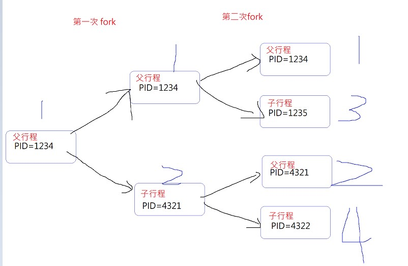

# 109b 系統程式上課筆記

## 第十二週
系統程式 第 12 週 -- posix: fork, fs, shell   [FB連接](https://www.facebook.com/ccckmit/videos/10158962564926893/)  
<br>
本周精華註解在下面

## 執行 08posix-03-fork 01-hello  

```  
gcc fork1.c -o fork1
ls
./fork1
```


```
 gcc fork2.c -o fork2
 ./fork2
```
```
gcc fork3.c -o fork3
./fork3
```
要結束fork3執行結果要  kill PID

<br>

## 08-03fork-02-child 
>fork傳回值是0 --> 子行程  
>fork傳回值非0 --> 父行程

<br>

## 08posix-03-fork-03-exec-execvp1.c
>execvp 行程替換 

```
int main() {
  char *arg[] = {"ls", "-l", NULL }; //參數設定
  printf("execvp():before\n");  //execvp 執行之前 所以印出before
  execvp(arg[0], arg); // execvp執行 ls -l
  printf("execvp():after\n"); // main被替換下場
}

```
>先印出before 再印出 ls -l
main程式被替換成execvp 所以after 不會跑


UNIX 設計時就是 用 fork+execvp 合成一個載入行程的動作
bash 本身也會呼叫 execvp 執行打進去的指令

UNIX用C語言改寫 所以關係緊密 兩者互相扶持

<br>

## 08-03fork-04system :
```
gcc system1.c -o system1
./system1
```
system1.c
```
int main() {
  system("ls -l");   // 執行system指令的時候會fork出一個行程 再用execvp去呼叫ls -l
  printf("main end!\n");
}
```

<br>

## 08-03-04-mysystem1.c

```
int mysystem(char *arg[]) {
  if (fork()==0) {       // fork == 0 是子行程
    execvp(arg[0], arg); // child : exec("ls -l")
  }
  int status;
  wait(&status); // 等子代執行完 再回到父代
  return status;
}

int main() {
  char *arg[] = {"ls", "-l", NULL }; //傳參數 (ls -l)
  mysystem(arg); (main進來後呼叫mysystem執行ls -l)
  printf("main end!\n");
}
```
>自己用linux系統函數呼叫創建一個system函數叫mysystem

>myssystem1
>先執行main，main裡執行到mysystem  
>mysystem進行fork 此時main繼續執行  
>子行程替換成ls -l 父行程等待子行程結束印出END  


<br>

# 08-03-05zombie 執行

```
gcc zombie.c -o zombie
./zombie
```

```
int main () {
  pid_t child_pid;
  /* Create a child process. */
  child_pid = fork ();
  if (child_pid > 0) { //父行程
    /* This is the parent process. Sleep for a minute. */
    sleep (60);         // 父行程sleep 60秒
  } else {
    /* This is the child process. Exit immediately. */
    exit (0);     //子行程立刻離開
  }
  return 0;
}
```
>ps查看時 發現有已離開卻未結束的子行程 -->zombie 殭屍行程  
>父行程還在但子行程未被回收

<br>

## 08-posix-04-fs -01-echo

```
gcc echo1.c -o echo1
./echo1.c
```

```
int main() {
  char line[SMAX];
  int n = read(0, line, SMAX); // 從 0 (標準輸入 stdin:鍵盤) //讀東西到字串裡面(line) 最多SMAX個字(自己定義128) 
  line[n] = '\0';              // 設定字串結尾 (SMAX-1比較好)
  write(1, line, n);           // 將 line 輸出到 1 (標準輸出 stdout)
  write(2, line, n);           // 將 line 輸出到 2 (標準錯誤 stderr)
}
```

預設  
>0代表 輸入裝置的檔案代號  stdin 標準輸入裝置
>1代表                   stdout 標準輸出
>2代表                   stderr 
>輸出和錯誤都到到終端機

Q：n是甚麼數字
>int n = read(0, line, SMAX);
>n 是指 read 讀到多少個 byte

>unix標準系統函數 -->read write

<br>

## 08-posix-04-fs -02 fecho

```
gcc fecho1.c -o fecho1
./fecho1
```
>會有警告 gets()不安全 (緩衝區溢位)
```
int main() {
  close(0);                      // 關閉標準輸入 stdin
  close(1);                      // 關閉標準輸出 stdout
  int a = open("a.txt", O_RDWR);         // 此時 open(打開a.txt)，會找沒被使用的最小檔案代號 --> 於是用剛剛被關掉的 0
  int b = open("b.txt", O_CREAT|O_RDWR, 0644); // 此時 open，會找沒被使用的最小檔案代號 1
  char line[SMAX];
  gets(line);                    // 從 0 (a.txt) 讀入一行字 line
  puts(line);                    // 輸出 line 到 1 (b.txt)  //把gets讀到的字寫到b.txt
  printf("a=%d, b=%d\n", a, b);
}
```

>a.txt 變成 gets對象 (因為取代掉標準輸入)
>b.txt 變成 puts對象 (因為取代掉標準輸出)


<br>

## fecho2.c

```
int main() {
  int fda = open("a.txt", O_RDWR);          // 打開檔案 a.txt 並取得代號 fda
  int fdb = open("b.txt", O_CREAT|O_RDWR, 0644);  // 打開檔案 b.txt 並取得代號 fdb
  dup2(fda, 0);                             // 複製 fda(a) 到 0 (stdin)  // 0被取代成a
  dup2(fdb, 1);                             // 複製 fdb(b) 到 1 (stdout)  // 1被取代成b
  char line[SMAX];
  gets(line);                               // 從 0 (a.txt) 讀入一行字 line
  puts(line);                               // 輸出 line 到 1 (b.txt)
}

```
>fecho1 是導到檔案  
>現在是 a取代0 b取代1  
>gets 從a讀   
>puts會印到b檔    

<br>

## 08-05-v1 -myshell.c

```
#include "../myshell.h"

int main(int argc, char *argv[]) {
  char path[SMAX], cmd[SMAX];
  getcwd(path, SMAX-1); // getcwd取得初始路徑
  while (1) { // 不斷等待使用者輸入命令並執行之
    printf("myshell:%s $ ", path); // 顯示提示訊息
    fgets(cmd, SMAX-1, stdin);     // 等待使用者輸入命令
    system(cmd);                   // 呼叫system執行命令
  }
}
```

```
gcc myshell.c -o myshell
./myshell
```
>進入myshell
>只能在指針對system呼叫的路徑有效
>ctrl+c 離開

<br>

## v2 解決路徑切換問題

```
#include "../myshell.h"

// 將檔案讀入成為字串
int readText(char *file, char *text, int size) {
  FILE *f = fopen(file, "r");
  int n = fread(text, 1, size, f);
  fclose(f);
  return n;
}

int main(int argc, char *argv[]) {
  char ipath[SMAX], path[SMAX], cmd[SMAX], fullcmd[SMAX], pathFile[SMAX];
  getcwd(ipath, SMAX-1); // 取得初始路徑
  strcpy(path, ipath);   // path = ipath
  sprintf(pathFile, "%s/path.txt", ipath); // pathFile=<ipath>/path.txt
  while (1) { // 不斷等待使用者輸入命令並執行之
    printf("myshell:%s $ ", path); // 顯示提示訊息
    fgets(cmd, SMAX-1, stdin);                     // 等待使用者輸入命令
    strtok(cmd, "\n");             // 切掉 \n
    if (strcmp(cmd, "exit")==0) break;
    sprintf(fullcmd, "cd %s;%s;pwd>%s", path, cmd, pathFile); // fullcmd = 切到 path; 使用者輸入的命令; 將路徑存入 pathFile 中。
    system(fullcmd);               // 執行 fullcmd 
    readText(pathFile, path, SMAX);// 讀 pathFile 檔取得路徑
    strtok(path, "\n");            // 切掉 \n
  }
}
```


```
gcc myshell.c -o myshell
./myshell
```
>cd 有效 可以切換
 
## googlemeet 問題 :

mysystem1:
fork出子行程
如果fork=0 子行程 被替換掉
父行程沒被替換 main執行完
一個再執行的程式-->process
fork會傳回行程代號 (整數且通常大於0


