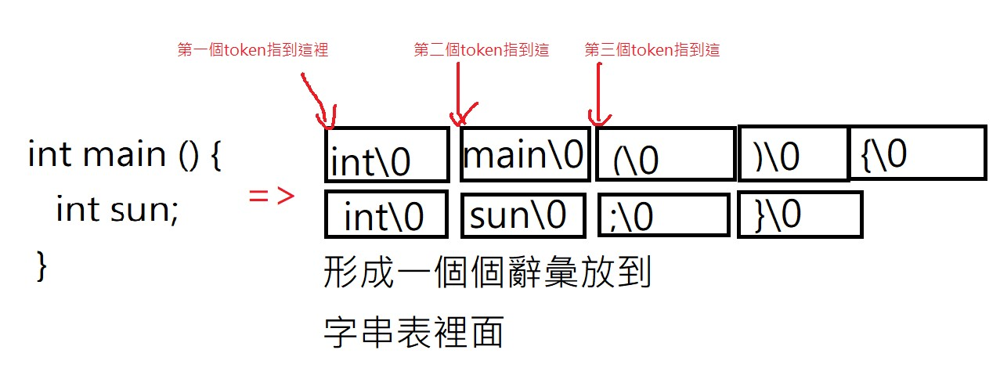
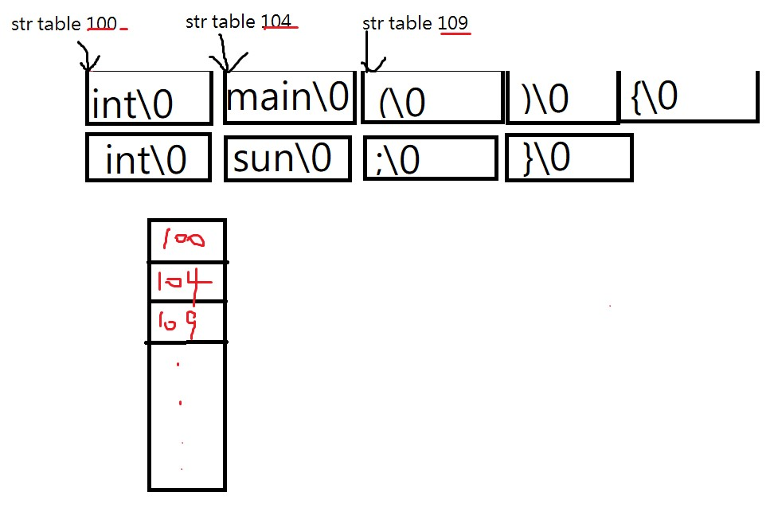
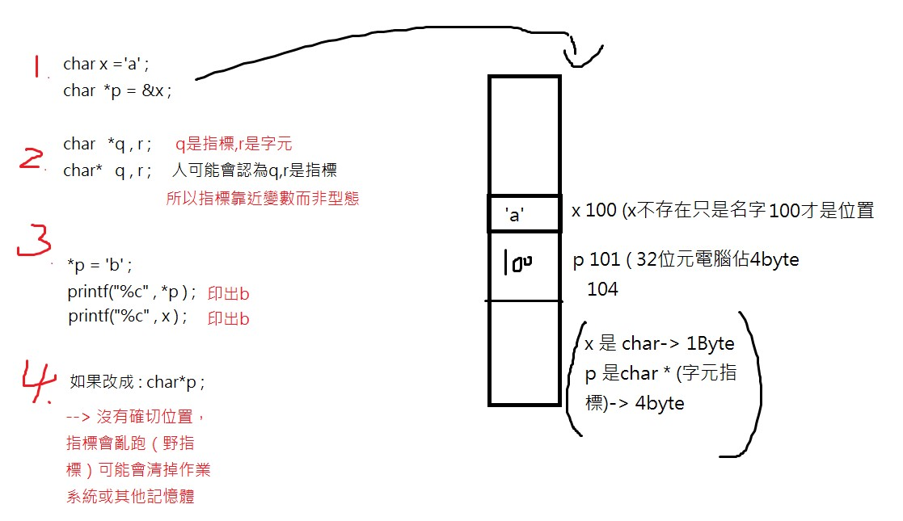

# 109b 系統程式上課筆記

## 第三周
系統程式 第三週  編譯器(https://www.facebook.com/ccckmit/videos/10158818166811893/)  
 
[精華濃縮 : 程式講解筆記compiler-lexer-lexer.c](https://gitlab.com/AIONLin/sp/-/blob/master/03-compiler/02-lexer/lexer.c) 

 

>fopen：FILE *fopen(const char *filename, const char *mode)

const char *filename(第一個參數) -- 這是C字符串，其中包含要打開的文件名(檔案名稱)。  
const char *mode(第二個參數) -- 這是C字符串，其中包含文件訪問模式(開啟模式)。
>模式(mode)有r、w、a等等 ：  
r：打開一個文件進行讀取。該文件必須存在。  
w：創建一個空的書麵文件。如果已經存在具有相同名稱的文件，其內容被刪除的文件被認為是一個新的空文件。  
a：附加到文件中。寫入操作的數據追加在文件末尾的。該文件被創建，如果它不存在。  
r+：	打開更新文件讀取和寫入。該文件必須存在。  
w+：	創建一個空文件，讀取和寫入。  
a+：	打開一個文件的​​讀取和追加。  

 

>sizeof() : C的運算子，產生其運算元的大小（相對於類型的大小）

 

　

 

>從程式到字串表
  

 

>指標還原成記憶體位置比較好

 

>Segmentation fault : 沒有設初值導致存取到不該存取位置

  

參考資料：  
https://www.cplusplus.com/reference/cstdio/fopen/  
http://tw.gitbook.net/c_standard_library/c_function_fopen.html

https://docs.microsoft.com/zh-tw/cpp/cpp/sizeof-operator?view=msvc-160
