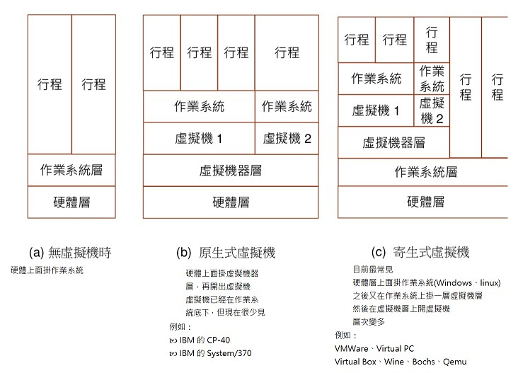
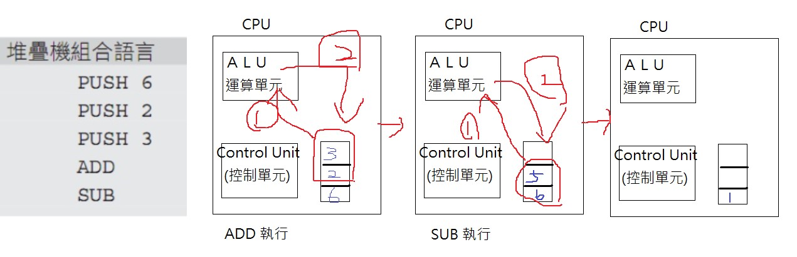

# 109b 系統程式上課筆記

## 第五週
系統程式 第五週 -- 虛擬機＋連結器+multipass    [FB連接](https://www.facebook.com/ccckmit/videos/10158852743611893/)  
<br>
本周精華註解在下面

<br>虛擬機(Virtual Machine)和模擬器(simulator)有重疊但又不完全一樣 : 
>虛擬機通常只模擬初CPU整套指令集，模擬器通常指模仿外部行為

原生與寄生式的虛擬機：<br>


<br>

中間碼：
>設計出一套中間碼，用虛擬機執行這套中間碼，此作法具有跨平台能力  
>例如JAVA 的 bytecode ：可在 JVM 虛擬機中執行  
>或微軟的 MSIL：可在 .NET 平台中執行


三種虛擬機架構 :   
> 記憶體機 (Memory Machine) : 可以直接對記憶體變數進行運算  --> 類似編譯器範例輸出結果  
> 暫存器機 (Register Machine) : 必須將變數載入暫存器中，才能進行運算 -->有固定暫存器可以把變數載入   
> 堆疊機 (Stack Machine) : 取出堆疊上層元素進行運算  結果存回堆疊之中  -->預設把堆疊最上面東西(最後進去的)抓下來做運算(不用參數)




Java的虛擬機 : 
>環境設定 :  
```
multipass list (看新建sp109b是否顯示running)   
multipass shell sp109b (啟動)  
gcc  (#看gcc是否可以啟用 )   
sudo apt install gcc  (如果不行就先安裝)  
java  
sudo apt install default-jre (安裝)  
sudo apt install default-jdk  
sudo apt install make 
```
>執行程式 HelloWorld.java :
```
cd sp/06-vm/01-jvm  (進到資料夾)  
javac HelloWorld.java (建置)  
ls    (看到檔案出現)  
java HelloWorld  
```

>執行程式 Factorial.java : 

```
cd 02-pitifulvm/src
make   
javac tests/Factorial.java  
ls tests/Factorial.*  
cd tests    (進到tests)
java Factorial  
java Factorial.class  
java Factorial  
```
>執行程式 Primes.java :
```
javac Primes.java
java Primes
cd .. (到上一層用他的jvm.c)
./jvm tests/Primes.class (也可以跑)
```

<br>


[QEMU 虛擬機 :](https://zh.wikipedia.org/zh-tw/QEMU)
>[Fabrice Bellard 做的](https://en.wikipedia.org/wiki/Fabrice_Bellard?fbclid)  
>他還做了FFmpeg (把影片拆成jpg或把jpg弄成影片)
>[Fabrice Bellard個人網站](https://bellard.org/)

<br>

C4 (自帶虛擬機 所以可以在任何平台執行) : 

>到c4資料夾打開終端機


```
gcc -m32 c4.c -o c4   (m32 因為電腦64位元) #會有warning但可以執行  
./c4 test/hello.c    (測試程式:用tset資料夾下的程式)  
./c4 c4.c test/hello.c   (c4是可以自己編譯自己的程式) (第二個c4.c送進去執行檔編譯出一個虛擬機) (編出來的虛擬機把hell.c當輸入編譯執行hello.c)  
./c4 c4.c c4.c test/hello.c  (第二個c4.c送進去執行檔編譯出一個虛擬機)(第三個c4.c送進去邊出來的虛擬機)(hello.c送進去編出來再編出來的虛擬機編譯) (再加c4會太多層)  
./c4 -s test/hello.c     (加上 -s 參數可以印出組合語言)

```
>C4 編譯完成後，會立刻執行編譯出來的機器碼  
>C4 只支援了剛好足夠《自我編譯》的那些 C 語言語法。

 支援的語法 : 

項目 | 語法
-----|-------------------
判斷 | if ... else
迴圈 | while (...)
區塊 | {...}
函數呼叫 | f()
函數定義 | int f(....)
傳回值 | return 
陣列存取 | a[i] 
數學運算 | +-*/%, ++, --, +=, -=, *=, /=, %=
位元運算 | &|^~
邏輯運算 |  ! && || 
列舉 | enum ...
運算式 | (a*3+5)/b 
指定 | x = (a*3+5)/b
取得大小 | sizeof
強制轉型 | (int*) ptr; (char) a;
基本型態 | int, char
指標 | *ptr 
遞迴 | int f(n) { ... return f(n-1) + f(n-2); }
陣列存取 | a[i]


<br><br><br>


參考資料：  
[Fabrice Bellard](https://en.wikipedia.org/wiki/Fabrice_Bellard?fbclid)  
[Java virtual machine](https://en.wikipedia.org/wiki/Java_virtual_machine)   
[JVM | What is Java Virtual Machine & its Architecture](https://www.guru99.com/java-virtual-machine-jvm.html?fbclid=IwAR13zFGM4DYdVoJXfNXBoQevEhJFX-mBwtWNGpqbFAUg7d7jT36FZgjOoA8)   